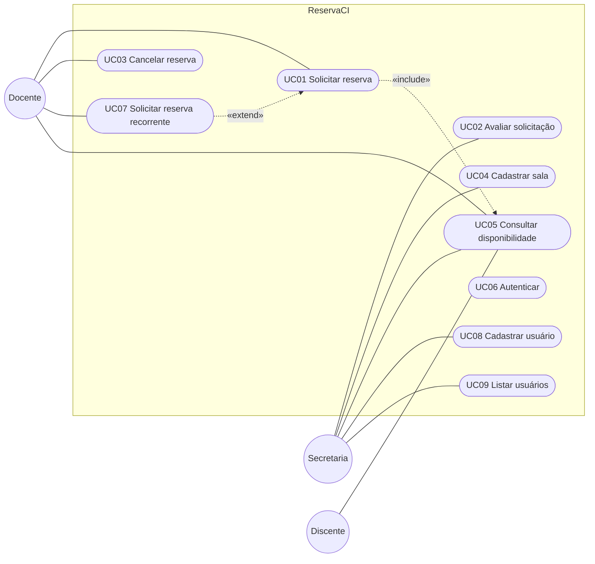

# Casos de uso

> Seção 6 do modelo. Os **requisitos** (RF) e seus **cenários de aceitação** estão em `openspec/specs/`.
> Aqui ficam o diagrama com **todos** os casos de uso e a descrição detalhada **apenas dos 3 mais importantes**.

## 6.1 Diagrama de casos de uso

O diagrama abaixo usa Mermaid, que o GitHub desenha direto na página. A versão em UML formal (PlantUML) está em [`casos-de-uso.puml`](casos-de-uso.puml).

> Todos os casos de uso pressupõem UC06 (Autenticar) — omitido das ligações para não poluir o diagrama.

## Índice e rastreabilidade

| Caso de uso | Ator principal | Requisitos | Descrição detalhada |
|---|---|---|---|
| UC01 Solicitar reserva | Docente | RF02, RF03, NF-USA-01, NF-CON-01 | [UC01](UC01-solicitar-reserva.md) |
| UC02 Avaliar solicitação | Secretaria | RF04, NF-SEG-02 | [UC02](UC02-avaliar-solicitacao.md) |
| UC03 Cancelar reserva | Docente | RF05, NF-SEG-02 | [UC03](UC03-cancelar-reserva.md) |
| UC04 Cadastrar sala | Secretaria | RF01 | — |
| UC05 Consultar disponibilidade | Docente, Discente, Secretaria | RF02, NF-DES-01 | — |
| UC06 Autenticar | Todos | RF10, NF-SEG-01 | — |
| UC07 Solicitar reserva recorrente | Docente | RF06, NF-CON-01 | — |
| UC08 Cadastrar usuário | Secretaria | RF07, RF11, RF12, NF-SEG-03, NF-MAN-01, NF-CON-03 | — |
| UC09 Listar usuários | Secretaria | RF09, NF-SEG-03 | — |

**Regra:** depois da primeira entrega, IDs de casos de uso **não** são renumerados nem reaproveitados.
