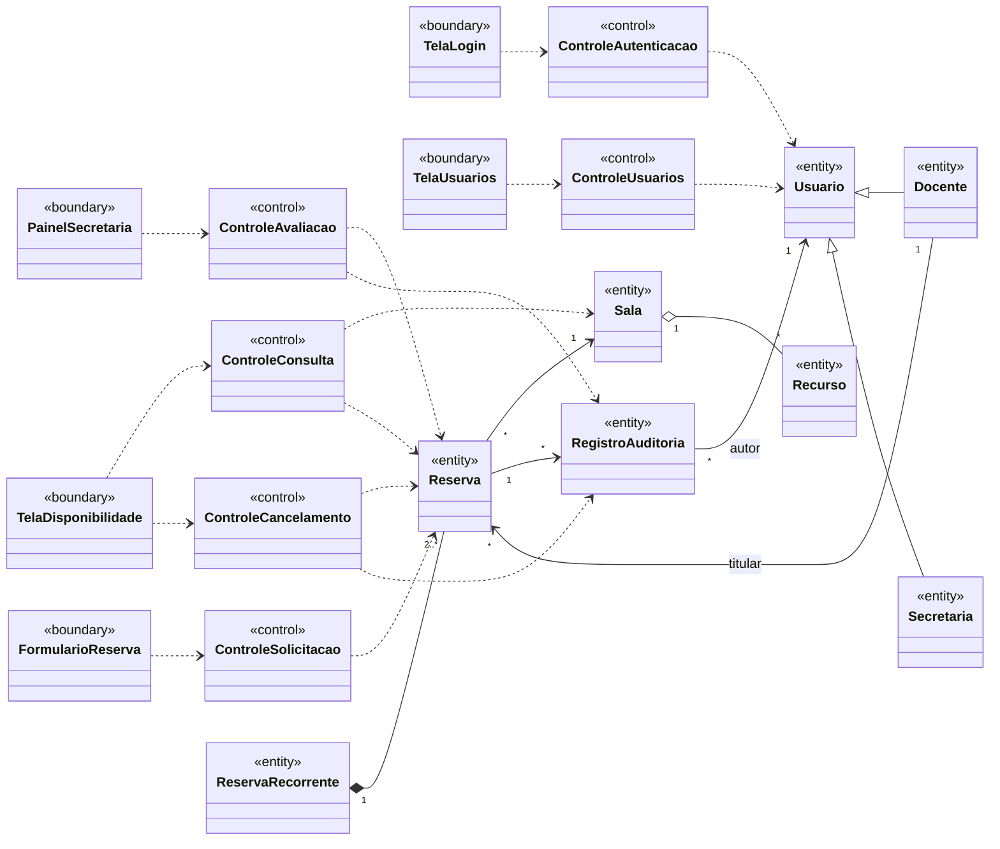

# Análise de casos de uso — diagrama de classes de análise

> Seção 7 do modelo. Classes **sem atributos e métodos**, mas com os relacionamentos já definidos.
> Estereótipos ICONIX: «boundary» (fronteira), «control» (controle), «entity» (entidade).
> Os nomes das entidades vêm do [glossário](02-glossario.md).

## Rastreabilidade caso de uso → classes de controle

| Caso de uso | Controle | Fronteiras |
|---|---|---|
| UC01 Solicitar reserva | ControleSolicitacao (usa ControleConsulta) | TelaDisponibilidade, FormularioReserva |
| UC02 Avaliar solicitação | ControleAvaliacao | PainelSecretaria |
| UC03 Cancelar reserva | ControleCancelamento | TelaDisponibilidade |
| UC05 Consultar disponibilidade | ControleConsulta | TelaDisponibilidade |
| UC06 Autenticar | ControleAutenticacao | TelaLogin |
| UC08 Cadastrar usuário | ControleUsuarios | TelaUsuarios |
| UC09 Listar usuários | ControleUsuarios | TelaUsuarios |
