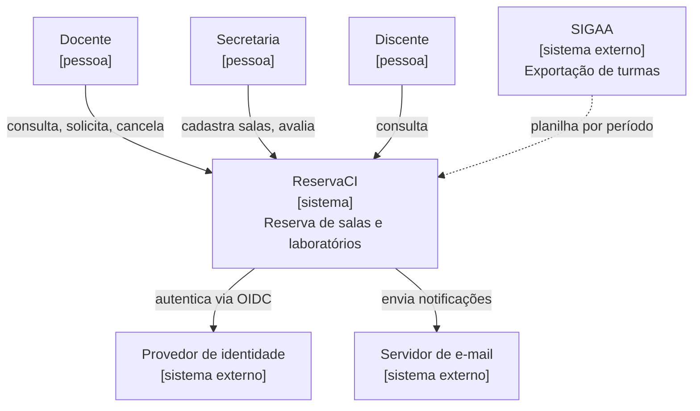
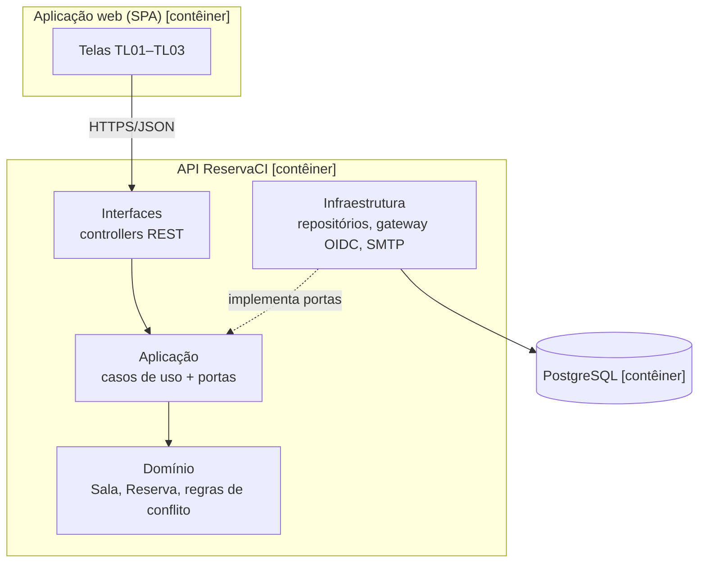
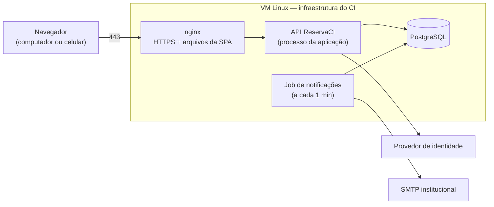

# Arquitetura

> Seção 9 do modelo. Pelo menos um diagrama de arquitetura **lógica** e um de arquitetura **física**, e a explicação de **como cada requisito não funcional é atendido**.
> Diagramas no estilo [C4](https://c4model.com/). Decisões importantes ficam registradas como ADRs em [`adr/`](adr/).

## 9.1 Contexto (C4 nível 1)

## 9.2 Arquitetura lógica — contêineres e camadas (C4 nível 2)

Monolito modular em camadas (ver [ADR-0001](adr/0001-monolito-modular.md)). Dependências apontam sempre para dentro: interfaces → aplicação → domínio; infraestrutura implementa as portas definidas na aplicação.

## 9.3 Arquitetura física — implantação

## 9.4 Como cada requisito não funcional é atendido

| RNF | Decisão / tática arquitetural | Onde |
|---|---|---|
| NF-USA-01 | Formulário pré-preenchido a partir da grade; reserva em 3 interações | TL01 → TL02 |
| NF-USA-02 | SPA responsiva (layout em coluna abaixo de 600 px) | Contêiner web |
| NF-DES-01 | Índice por (sala, intervalo) no PostgreSQL; consulta de disponibilidade em uma única query | [ADR-0002](adr/0002-conflito-no-banco.md) |
| NF-SEG-01 | Todas as rotas da API exigem token OIDC; nginx só serve a SPA e o callback de login | Interfaces + gateway OIDC |
| NF-SEG-02 | Tabela de auditoria só de inserção, gravada na mesma transação da mudança de status | Infraestrutura |
| NF-CON-01 | Restrição de exclusão (`EXCLUDE USING gist`) impede sobreposição mesmo com requisições simultâneas | [ADR-0002](adr/0002-conflito-no-banco.md) |
| NF-CON-02 | Um único processo + banco na mesma VM; backup diário; monitoramento externo de disponibilidade | Implantação |
