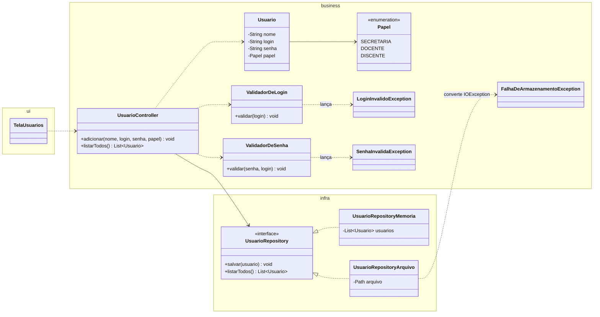

# Projeto detalhado — pacotes, classes de projeto e padrões

> Não existia no modelo .docx. Aqui fica o **diagrama de classes de projeto**, que evolui a cada sprint, diferente do diagrama de **análise** (`05-analise.md`), que é conceitual e muda pouco.
> Atualize este arquivo em **toda** sprint (ver [cronograma](00-entregas.md)).

## 1. Divisão de pacotes

Sugestão (exemplo em Java; adapte à sua linguagem). Os nomes das camadas acompanham as sprints: **ui**, **business** e **infra**.

```text
src/main/java/br/ufpb/reservaci/
├── ui/                    ← fronteiras: telas, console, menus
├── business/
│   ├── model/             ← entidades: Usuario, Papel, Reserva...
│   ├── control/           ← controles: UsuarioController... (S3: FacadeSingletonController)
│   └── exception/         ← exceções de negócio: LoginInvalidoException...
└── infra/                 ← persistência: UsuarioRepository e implementações; adaptadores (S4)
src/test/java/br/ufpb/reservaci/   ← mesma estrutura; um teste por cenário das specs
```

**Regra de dependência:** `ui` → `business` ← `infra`. A camada `business` não importa nada de `ui` nem de classes concretas de `infra`.

## 2. Diagrama de classes de projeto

### Estado atual: Sprints 1 e 2 (exemplo do ReservaCI)



> Nas Sprints 1–2 a interface `UsuarioRepository` fica em `infra`, como no diagrama. Na Sprint 4 (Repository) ela passa para `business` e só as implementações ficam em `infra`, invertendo a dependência.

## 3. Padrões de projeto utilizados

Preencha uma linha por padrão aplicado. Cada padrão relevante também tem um ADR.

| Padrão | Sprint | Classes participantes (papel no padrão) | Problema que resolve no projeto | ADR |
|---|---|---|---|---|
| Singleton | S3 | | | |
| Facade | S3 | | | |
| Repository | S4 | | | |
| Factory Method / Abstract Factory | S4 | | | |
| Adapter | S4 | | | |
| Template Method | S4 | | | |
| Command | S5 | | | |
| Memento | S5 | | | |
